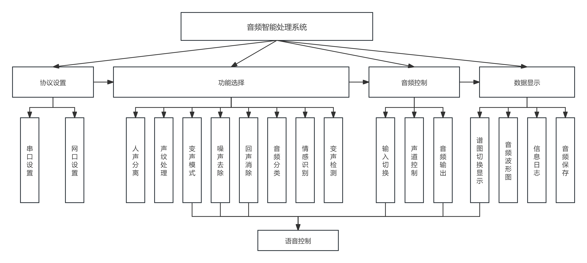
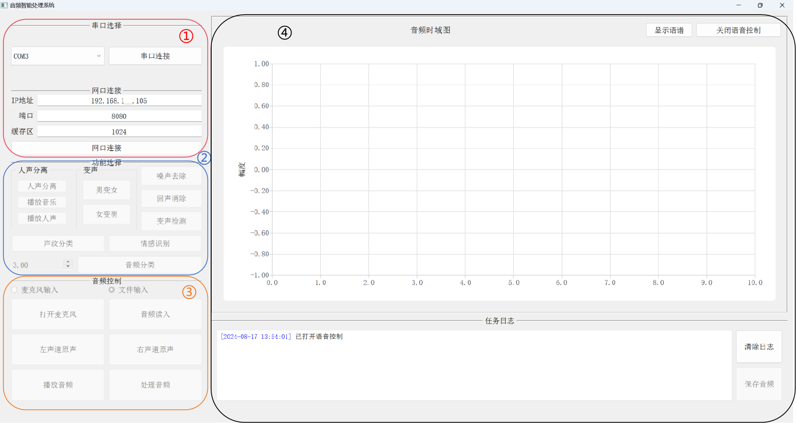
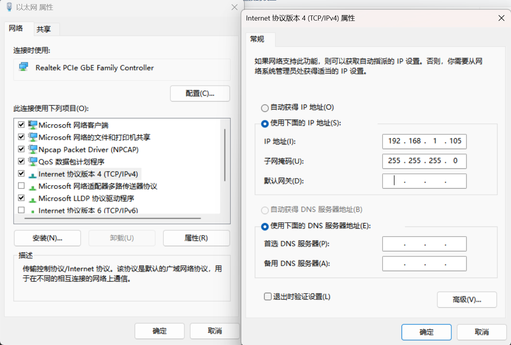

# 基于紫光同创盘古开发板的音频魔盒系统——第八届集创赛紫光同创杯国家二等奖

\
\
\
\


# 前言

该设计是在第八届集成电路创新创业大赛紫光同创杯的杯赛要求下设计完成的。语音处理技术广泛应用在手机、视频会议系统、金融安全、刑侦等多种领域，本赛题要求采用紫光同创FPGA实现多种功能的音频信号处理，并对处理后的音频效果进行实时展示、对处理前后的音频频谱进行实时展示，基础的语音处理包含音频去噪、实时人声调整（男中音类型音频调整为女低音类型等）、音频回声消除、音乐消除；提高要求包括：将采集后的音频信号通过紫光同创PCIE或者以太网输入到上位机进行更丰富的实时效果展示，如音频人物画像（性别、年龄、情绪等）、采用卷积神经网络对从FPGA采集后的音频进行分类（爆炸、尖叫、唤醒等功能），并进行声纹识别，并给出系统处理延迟数据。其中：人声分离、男女声转换、噪声去除、回声消除、声纹识别均由FPGA独立完成，变声检测、情感识别和声纹分类为上位机完成。

本项目为第八届集创赛紫光同创杯国家二等奖配套软件代码，配合紫光盘古开发板硬件设施完成上述要求，硬件代码请转到https://github.com/zzzzzxh499/Pango_voice_magicbox.git 作者@zzzzzxh499。为了实现本设计所述的功能，我们设计了一个基于PyQt5的GUI窗口，被分为协议设置区域、功能选择区域、音频控制区域和数据显示区域，每个区域存在不同的功能选择，其大致功能如下。




# 项目简介


# 软件功能

1. 协议设置：该功能区域负责串口与网口的连接。在串口选择窗口中，可以选择对应的COM端口，波特率默认为115200；在网口连接窗口中，可以输入与FPGA相连接的网络IP地址，端口以及UDP数据缓存区域大小。
2. 功能选择：该功能区域负责FPGA以及上位机的音频处理模式选择。在该窗口中，可以控制FPGA进行人声分离、男生变女声、女声变男声、噪声去除、回声消除和音频分类等。
3. 音频控制：该功能区域负责FPGA的音频输出方式。在该窗口中，可以修改音频的输入方式，输出方式以及控制音频的处理和播放。
4. 数据显示：该功能区域负责FPGA的音频输出的可视化展示。音频时域图可以实时给出输出音频信号的时域信息，下方的任务日志展示本软件的使用信息，也可保存所播放的音频。可以控制FPGA输出谱图类型，以及对语音控制进行开启和关闭。

# 使用准备

- Anaconda 3
- Python 3.8
- Windows 10 or 11
- requirement.txt

# 安装环境

- 首先安装Pytorch的GPU版本，根据自身显卡的CUDA版本
- 安装依赖库

```shell
pip install -r requirment.txt
```

# 模型

本项目未设计数据训练过程，语音分类和情感识别网络已经训练完成，模型下载链接：https://pan.baidu.com/s/1Cpdx2PAOjsnXUW7qcrJ3zw 提取码：srxf

下载完成后将文件夹放置到代码根目录。如需要自身训练代码，请自行进行部署。

# 软件使用

## 网络设置

在电脑搜索框输入“查看网络连接”，打开网络连接，右键点击当前网口对应的“以太网”，点击“属性”，在“网络”选项卡中找到“Internet 协议版本4(TCP/IPv4)”，双击进行属性配置，在打开的窗口中，选择“常规选项卡”，点击“使用下面的IP地址”，将IP地址设置为192.168.1.105，子网掩码为默认值即可。



## 硬件连接

将盘古开发板对应接口与上位机连接，连接的接口有网口、Uart串口、音频输入和HDMI输入，板载输出与对应设备相连接，连接完毕后打开开发板电源。

## 使用准备

在电脑上下载Wireshark软件(https://www.wireshark.org/) 进入Wireshark，监控对应ip地址的以太网接口。打开软件界面：

```shell
python gui_main.py
```

选择对应串口，点击连接串口；在ip地址栏输入192.168.1.105，端口输入8080，缓存区默认为1024。点击网口连接即可准备进行音频处理

## 功能展示

### 使用方式

本软件联合硬件实现的功能有：人声分离、男女声转换、噪声去除、回声消除、变声检测、声纹分类、情感识别、音频分类和声纹识别。

在“文件输入”模式下，以上功能除**声纹分类和声纹识别**，其余功能操作均如下：点击“音频读入”读入当前音频——>点击功能按钮——>点击“处理音频”——>点击“播放音频”。其中，变声检测，情感识别和声纹分类在点击处理音频后会在信息栏显示结果，其余需要点击播放音频才可得到处理结果，**在进行人声分离前，需要保证当前声卡没有任何输出。**。<u>特别的，点击"声纹分类"会跳转文件读入窗口，这时选择要进行分类的音乐文件夹，再点击“处理音频”，即可得到处理音频的结果，点击“生成分类图”会将结果以图像数据的形式展示</u>。**每次音频处理完成后，注意检查“处理音频”按钮是否使能**。

再“麦克风输入”模式下，除**声纹分类、情感识别和变声检测**外，其余功能均可正常使用，使用方法为选择功能——>点击“处理音频”，此时打开麦克风即可听到处理之后的实时音频和处理结果。关闭麦克风后，可以点击“播放音频”来回放之前所输入的音频信号。

在两种输入模式下，点击“播放音频”后均可以点击保存音频来将音频信号保存到电脑上。

**声纹识别**需要在板卡上进行操作，所有功能的详细操作可以观看b站视频https://www.bilibili.com/video/BV1UKpkeEEtX/

### 谱图展示

在软件右上方的按钮可以控制当前显示器的谱图展示，可以在语谱图和频谱图之间切换

### 语音控制

该软件可以使用语音对其进行简单控制，软件启动后默认打开，本项目使用科大讯飞对其进行语音唤醒，网站如下：https://console.xfyun.cn/services/awaken

语音唤醒特征词如下：


| 唤醒词       | 功能                            |
| ------------ | ------------------------------- |
| 切换输入模式 | 切换音频的输入模式为麦克风/文件 |
| 切换谱图显示 | 切换显示器显示语谱图/频谱图     |
| 男声变女声   | 打开“男变女”功能              |
| 女声变男声   | 打开“女变男”功能              |
| 打开噪声去除 | 打开“噪声去除”功能            |
| 打开回声消除 | 打开“回声消除”功能            |
| 播放音频     | 播放当前音频                    |
| 处理音频     | 开始处理音频                    |

如需关闭语音控制，在软件右上角点击对应按钮即可。

